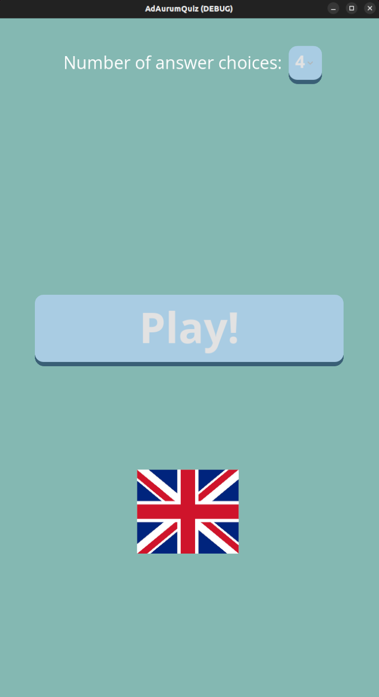
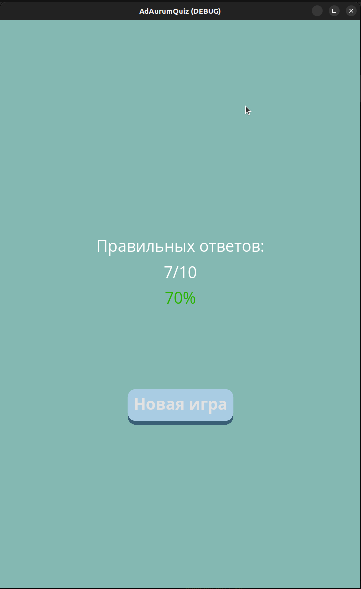

# ad-aurum-quiz
 This repository contains a quiz game developed using [Godot](https://github.com/godotengine/godot). The game features a simple quiz loop where players can answer questions and view the correct answers. 
Incorrect choices are highlighted in red. After completing all the questions, players can view basic statistics of their answers. Additionally, users have the option to set the maximum number of answers to be displayed. 


## Features

* Simple quiz game loop
* Answer feedback: Correct answers highlighted, incorrect answers shown in red
* Basic statistics of answers
* Сustomizable maximum number of answers displayed
* Support for multiple correct answers with checkbox interface
* Supports English and Russian localization

## Preview

<p align="center">



</p>

## How to add question

The questions are composed from 'questions.json' of the following structure:

```
[
{
  "question": "Question text goes here",
  "answers": [
    {"text": "Answer 1", "correct": true},
    {"text": "Answer 2", "correct": false},
    ...
  ],
  "background": "path/to/background/image.jpg"
},
...
]

```
## Time tracking

In total, I spent about six hours on this project. Three hours were spent on the functionality and three on the visual part.
All this time recording a screencast. Still found design flaws and minor bugs for a while.

<h1 align="center">
</h1>
<p align="center">

## Addons

Used the [Godot Scene Manager](https://github.com/glass-brick/Scene-Manager) addon for cool fancy transitions between game screens.

